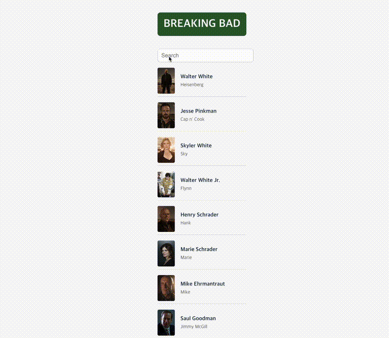

## Demo

# Typescript-character-finder

## 📖 About This Project
**Typescript-character-finder** is a solo project built with **TypeScript** and **React**.  
It started as a live search bar for *Breaking Bad* characters and is now being expanded into a more comprehensive **character encyclopedia** for fans and creative writers.  

As a huge fan of *Breaking Bad*, I’ve always been fascinated by the complex relationships between characters and the dramatic rise and fall of Walter White’s life.  
This project is my attempt to build an **interactive character guide** that lets users explore the cast, search characters in real time, and view detailed information about each one—all inside a **clean, responsive UI**.

---

## ✨ Features
- 🔎 **Live Search Bar**  
  Type into the search bar and instantly filter characters by name.  
  Example: typing `bo` will display **“Bob”** if it exists in the dataset.  

- 📱 **Responsive Design**  
  Works seamlessly across desktop and mobile with a clean layout.  

- ⚡ **Real-Time Updates**  
  Results update immediately as you type, showing either matched names or a “No results” message.  

- 🎨 **Simple & Scalable UI**  
  Designed with **Tailwind CSS** for fast iteration and easy customization.  

---

## 🛠 Tech Stack
| Category        | Technology           | Description |
|-----------------|----------------------|-------------|
| **Front-End**   | React.js + TypeScript | Build the UI and enforce type safety |
| **Styling**     | Tailwind CSS         | Utility-first CSS framework for clean & responsive design |
| **Tooling**     | Vite                 | Fast bundler for modern front-end projects |
| **Data**        | JSON (static file)   | Character data served from `/public/characters.json` |
| **Deployment** *(optional)* | Vercel / Netlify | Hosting options for deploying the app |

---

## 🎯 Why I Made This
I wanted to strengthen my **frontend skills** and practice building real-world features, specifically:
- Using **React state** (`useState`) for interactivity
- Building a **controlled input** (search bar)
- Filtering lists with **JavaScript** (`.filter()` + `.includes()`)
- Creating a **responsive design** with Tailwind CSS
- Organizing files in a scalable way for future features

---

## 📂 Project Structure
breaking-bad-project/
├── public/
│ └── characters.json # Character data
├── src/
│ ├── components/
│ │ └── CharacterList.tsx # Displays filtered list
│ ├── assets/ # (future images, icons)
│ ├── App.tsx
│ ├── main.tsx
│ └── index.css